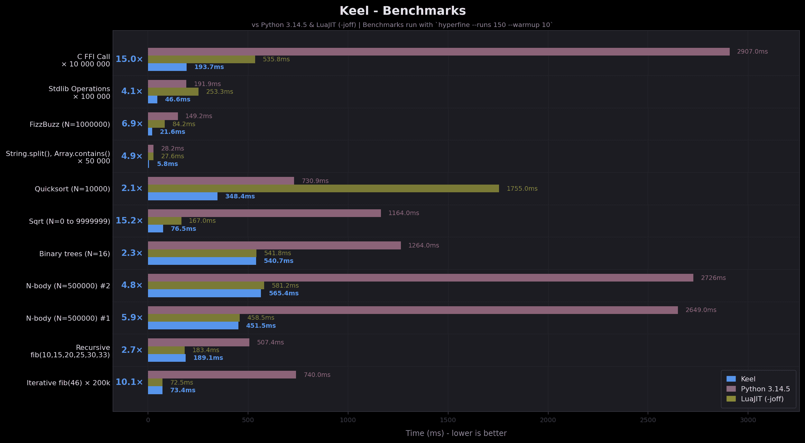

# Get started

## What, and why is Keel ?

!!! warning

    Keel is experimental and under active development (this documentation too). Little is set in stone.

Keel is a fast, statically-typed interpreted language that aims to combine Rust-like syntax with Python's ease-of-use.

Its goal is to provide a (much) faster alternative to Python that sits closer to low-level languages while remaining accessible to a wide audience. In other words, you should like Keel whether you're a seasoned Rust developer or you've barely touched Python and are completely new to programming.

Keel's main 'selling points' are:

- ~10x faster than Python, competitive with LuaJIT (-joff)
- Statically typed, with full type inference and zero annotations
- FFI support, and the ability to call C/dynamic libraries directly from Keel with a native/easy syntax.
- Embeddable in other programs through a C ABI.

The goal of this documentation / tutorial is to show Keel's syntax and how it works by example more than by theory.

## Installation

### On macOS / Linux

Keel provides a macOS / Linux installer, which you can use to download and install Keel by running the following command in your terminal: 
`#!bash curl -fsSL https://raw.githubusercontent.com/horacehoff/keel/main/install.sh | sh`

This will install the latest Keel version in `Library/Keel` on macOS, and in `/usr/local/lib/keel/` on Linux.

### On Windows

Keel doesn't provide a Windows installer yet. You must manually download it from [the latest release on GitHub](https://github.com/horacehoff/keel/releases/latest).

## Usage

Once installed, you can use the `keel` command like any other:

- To run the REPL, run: `#!bash keel`
- To run a `.kl` file [^extension], run: `#!bash keel file.kl`
- To display Keel's current version, run: `#!bash keel -v` or `#!bash keel --version`
- To display the available commands, run: `#!bash keel -h` or `#!bash keel --help`

[^extension]: Keel files have the `.kl` file extension.
*[REPL]: Read-Eval-Print-Loop

## Benchmarks
{ loading=lazy }
